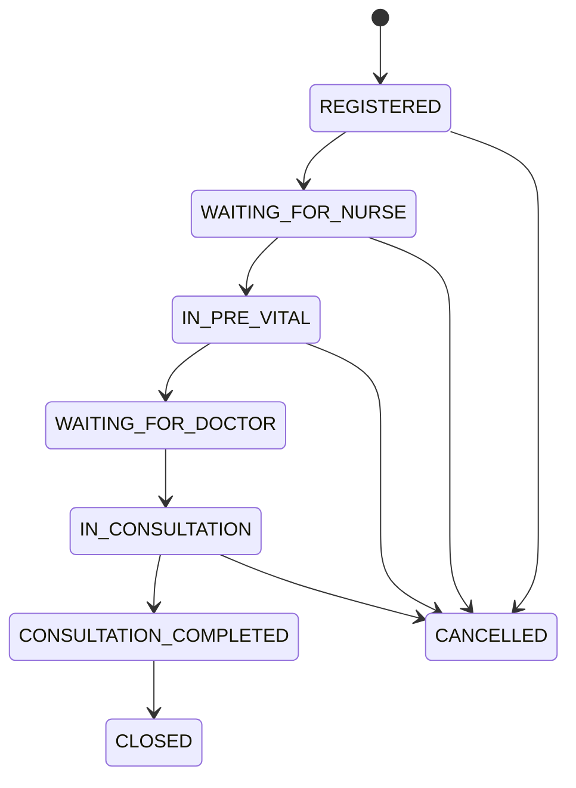
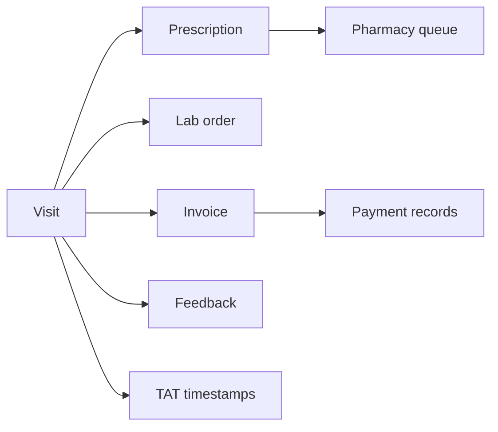

# OPD State Diagrams

## Visit lifecycle

## Independent workflows

Pharmacy, lab, billing, feedback, and TAT state never replace the canonical Visit status. Completed clinical documentation requires controlled amendment. Payment webhooks are signature-verified and idempotent. Feedback is unique per visit.
