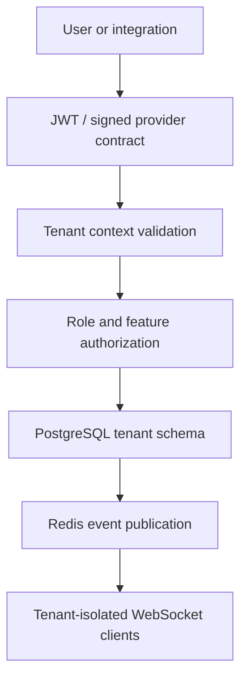

# Tenant Architecture

## Trust boundary

The tenant schema in the authenticated JWT is authoritative for tenant users. Client headers, query parameters, request bodies, cookies, and frontend state cannot switch tenant context. Razorpay webhooks resolve the tenant from verified order notes, then payment notes, and reject missing or malformed tenant values.

## Storage

- PostgreSQL is the system of record for clinical, operational, financial, audit, roster, and feedback data.
- Each hospital has an isolated tenant schema. Shared platform records live in `public`.
- Redis provides feature caching, refresh-token revocation, and Pub/Sub coordination. Redis loss must not lose committed data.
- WebSocket events are tenant/channel scoped and clients refresh authoritative API data after receiving events.

## Request path

`Authentication -> tenant isolation -> feature authorization -> role authorization -> resource authorization -> domain validation -> PostgreSQL transaction -> audit/event`

## Tenant lifecycle

Tenant provisioning and feature/plan changes are platform operations under `/api/v1/super/*`. Active tenant schemas are included in Alembic migration execution. Tenant feature changes invalidate the Redis cache and force stale sessions to re-authenticate.

---

## Pharmacy tenant isolation

All Pharmacy operational and clinical data follows the same tenant trust boundary.

Tenant-isolated data includes, as applicable:

- medicine/formulary configuration
- suppliers and procurement
- GRNs
- pharmacy locations
- inventory batches
- stock ledger
- dispensing
- returns
- transfers
- counts/adjustments
- pharmacy audit and alerts

Facility/location scope must be enforced in addition to tenant scope where the domain requires it. Client-supplied tenant identity must never switch Pharmacy context.
